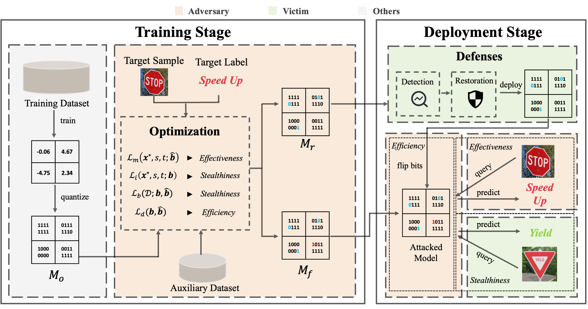

# One-bit Flip is All You Need: When Bit-flip Attack Meets Model Training 

This is the official implementation of our paper [One-bit Flip is All You Need: When Bit-flip Attack Meets Model Training](), accepted by ICCV 2023. This research project is developed based on Python 3 and Pytorch.


## Citation

If you think this work or our codes are useful for your research, please cite our paper via:

```bibtex
@inproceedings{dong2023one,
  title={One-bit Flip is All You Need: When Bit-flip Attack Meets Model Training},
  author={Dong, Jianshuo and Han, Qiu and Li, Yiming and Zhang, Tianwei and Li, Yuanjie and Lai, Zeqi and Zhang, Chao and Xia, Shu-Tao },
  booktitle={ICCV},
  year={2023}
}
```

## The Main Pipeline of Our Methods



## Requirement Commands (Anaconda):

Install by running the following cmd in the work directory 

```
conda create --name tba --file ./requirements.txt
```

## Running Examples

Step 1: [Download](https://www.dropbox.com/s/ax24afm1vqs9k8m/176_95.25.pth?dl=0) the model checkpoint, and then place it in the directory "checkpoint/resnet18"

Step 2: Fill out the path to this work directory in your server

Step 3: configure the path to CIFAR-10 dataset in ``config.py``

Step 4: run the demo

```shell
python ./test_lambda.py -dc cifar10 -mc ResNet18 -bw 8 --mannual -ri 1 -ro 30
```


## Variables

### Task Specification
```
-bw: bit width (quantization config), 8 is provided in demo.

-mc: model choice, ResNet18 is provided.

-dc: dataset choice, cifar10 is provided.

-tn: number of target instances, no effect in demo

--rc: whether to randomly choose auxiliary samples
```
### Hyperparameter Specification
```
--mannual: whether to mannually set hyperparameters (False means using default values defined in config.py)

-bs_l: base lambda, set to 1 as default

-ri: inner ratio, lambda_in in paper

-ro: outer ratio, lambda_out in paper

-lr: learning rate for updating parameters
```

## Results
The log for attacking 8-bit quantized ResNet-18 is provided. Please refer to `log_resnet18_8.txt` for our results.


## License 

This project is licensed under the terms of the Apache License 2.0. See the LICENSE file for the full text.
